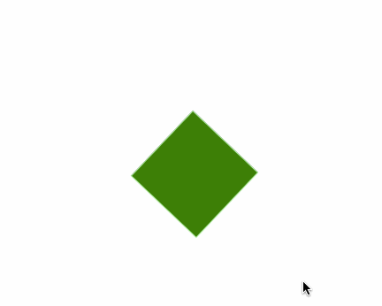

# Animación con CSS

## Objetivo

Aprender a animar elementos usando

- propiedad "animation"
- @keyframes

## Ejemplo

Hay un elemento "div". 
Lo queremos animar

```html
    <div class="elemento"></div>
```

```css
.elemento {
    width:100px;
    height:100px;
    position:absolute;
    top:50%;
    left:50%;
    border: solid 1px lightgreen;
    background-color: lightcoral;
}

```


## Pasos para animar un elemento

1. Crear animación usando "@keyframes"
2. Crear clase CSS que use la animación
3. Agregar clase al elemento

## Ejemplo (Mover a la derecha 200px)

1. Crear animación:

```css
@keyframes moverDerecha {
    0% {
        transform: translateX(0);
    }

    100% {
        transform: translate(200px);
    }
}

```

2. Crear clase CSS

```css
.efecto1 {
    /* Usar animación "moverDerecha", duración: 1s => 1 segundo
    animation: moverDerecha 1s;
}
```

3. Usar

```html
<div class="efecto1"></div>

```
### Notas:

- 0% : Inicio de la animación
- 100% : Fin de la animación
- transform: Transformar ( mover, rotar, etc.)

### Algunas Opciones de transform:

Ejemplos:

- translateX(200px) : Mover a la derecha 200px
- translateX(-100px) : Mover a la izquierda 100px
- rotateZ(50deg) : Rotar 50 grados (eje Z) (deg = degrees = grados)
- rotateX(50deg) : Rotar 50 grados (eje X) 
- rotateY(50deg) : Rotar 50 grados (eje X) 
- scale(2) : 2 veces más grande
- scale(0.5) : Hacer más pequeño (la mitad)


### Animar transparencia (opacity)

Sirve para hacer aparecer o desaparecer

```css
@keyframes esconder {
            0% {
                opacity:1;
            }

            100% {
                opacity:0;
            }
        }

.efecto-esconder {
    animation: esconder 2s;
}
```

### Repetir animación

A veces queremos repetir la animación por siempre

- usar **infinite**

``` css
.efecto-infinito {
    animation: efecto2 3s alternate-reverse infinite;
}

```

### Se pueden combinar propiedades para animar


```css
@keyframes mover-desaparecer {

            0% {
                opacity:1;
            }

            100% {
                opacity:0;
                transform: translateX(200px);
            }
        }

.efecto-salida {
    animation: mover-desaparecer 2s;
}
```


### Ejemplo: Agrandar en la mitad

``` css
@keyframes efecto1 {
    0%{

        transform: scale(1)
    }
    50% {
        /* Agrandar en la mitad de la animación*/
        transform: scale(2)
    }
    100% {
        /* Volver al tamaño normal (1)*/
        transform: scale(1)
    }
}
```
### Ejemplo: Rotar y animar color

```css
 @keyframes efecto2 {
            0%{

                transform: rotate(0);
                background-color: yellow;
                
            }
            50% {
                background-color: green;
                
            }
            100% {
                /* Volver*/
                transform: rotate(360deg);
                background-color: blueviolet;
            }
        }
```



### Práctica

- Crear página en CodePen
- Agregar varios elementos
- Usar una animación diferente en cada uno.

